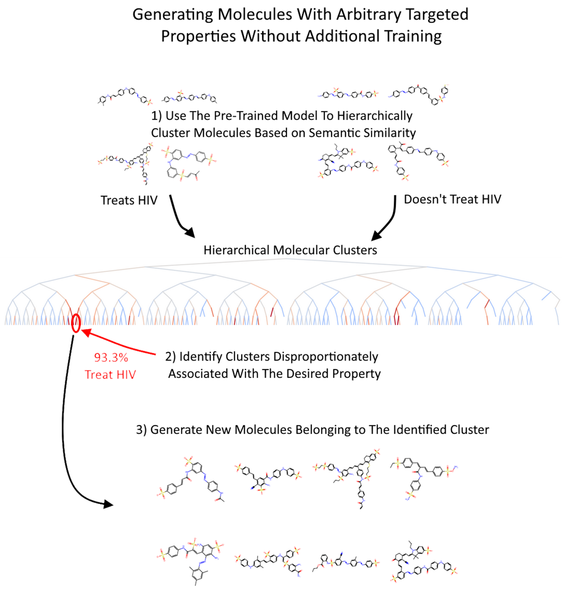
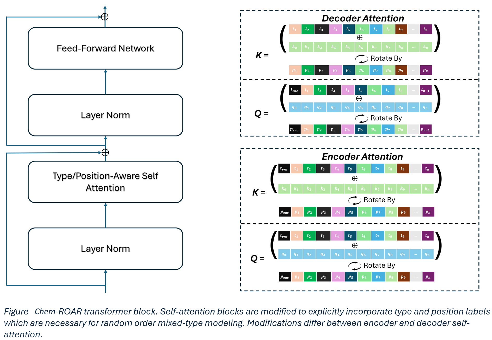
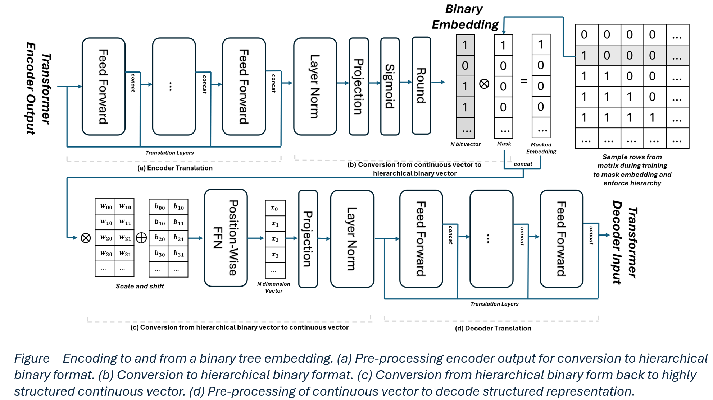

# ChemROAR
ChemROAR is a novel generative embedding architecture for hierarchically clustering molecules based on semantic similarity and generating new molecules based on those clusters. 

This approach enables the design of molecules with targeted characteristics with minimal data using a pre-trained model without fine-tuning. It also allows for statistical estimation of the likelihood that generated molecules will exhibit specific desirable properties.



# Description
ChemROAR is a transformer-based autoencoder that produces hierarchical binary embeddings. This naturally produces hierarchical discrete clusters. It utilizes a Random Order AutoRegressive (ROAR) decoder to learn complex dependencies between SMILES sequences and various molecular properties. The autoregressive decoder allows it to generate new molecules belonging to specific clusters through conditional generation.

# Architecture Details
ChemROAR uses a modified position and type aware self-attention operation. This allows it to handle random order modeling of mixed-type data. Each token is represented as a triplet comprising a Type, Position, and Value, which allows multiple data modalities to be incorporated into a single context without necessitating architectural changes or an overly large vocabulary. ChemROAR combines SMILES sequences and tabular molecular properties in the same self-attention operation during training. The decoder's random order modeling forces ChemROAR to learn to predict molecular properties from SMILES sequences and vice versa. 



The encoder produces a hierarchical binary embedding where each additional bit seeks to improve the decoders predictions by as much as possible. This semantically partitions molecules into a binary tree where each bifurcation represents some high-level difference. Nodes in this tree are clusters. Higher-level clusters capture broader, less specific traits and encompass more molecules, whereas lower-level clusters focus on detailed, specific properties but contain fewer molecules. Each cluster is discrete and therefore well defined. There is no uncertainty about how the cluster is defined or which cluster a molecule is in. Each cluster contains a specific number of molecules with specific properties. This enables the use of conventional statistical methods to quantify uncertainty and calculate confidence intervals about any property in each cluster. As ChemROAR can generate new molecules which verifiably belong to any cluster, it can generate molecules with targeted properties by generating new molecules from clusters where those properties are dramatically over-represented. The probability, and its confidence interval, and that a generated molecule will display a desired property can be estimated using the frequency of that property in the cluster used to generate it. 



# Efficient Representation of Molecular Characteristics
ChemROAR is not a conventional molecular embedding model. Its focus is on representing as much information about each molecule in as few bits as possible. The more bits in the embedding the more possible hierarchical clusters and the fewer molecules in each cluster. We need statistical power to predict the properties of each cluster. We therefore we need the model to group molecules based on key properties as early as possible in the tree. The performance-per-bit of the embeddings is therefore the most important criteria for this model. The table below shows the performance of an XGBoost model trained on MedROAR embeddings using the first 1 to 64 bits and compares this to the performance of an XGBoost model trained on a more conventional molecular embedding model like ChemBERTa2. 

We observe that ChemROAR is very effective at representing molecular information in a small number of bits. Using the first 64 bits of a ChemROAR embedding achieves 92% of the performance of a ChemBERTa2 embedding with 0.26% of the information.


# Example: Clusters of Molecules Which Inhibit HIV Replication
### We observe clusters where >90% of molecules inhibit HIV compared to the baseline 3.5% seen in the dataset as a whole


# Examples of Molecules Generated by ChemROAR Using the Cluster Most Likely to Inhibit HIV Replication
### Obvious similarities can be seen between different molecules in this cluster


# Usage
See [the demo notebook](demo.ipynb) for an illustrated version
```
import pandas as pd
import torch
import ROAR
from utils import make_binary_plot

data = <load your data here>

smiles_strings = data[<get smiles strings>]
property = data[<get a known property>]

#load model from huggingface
device = torch.device("cuda" if torch.cuda.is_available() else "cpu")
model = ROAR.ChemROAR.from_pretrained("willbaskett/ChemROAR").to(device)

############
#EMBED DATA#
############
embeddings = model.embed(smiles_strings)

X = pd.DataFrame(embeddings).astype(bool)
y = property.copy()

encodings = X.copy()
encodings["label"] = y

#get clusters of molecules most associated with the property, sorted.
clusters = make_binary_plot(encodings).sort_values("99% CI Low", ascending=False)

#get the node associated with the best cluster, defined as a T/F traversal of the tree
target_node_vector = torch.tensor(clusters.iloc[0].key).float()

#############################
#GENERATE ~100 NEW MOLECULES#
#############################
possible_solutions = []
while len(possible_solutions) < 100:
    generated_molecules = model.generate_molecules(target_node_vector, batch_size=128, evaluate_after_n_tokens=128, temperature=1, topk=500, topp=0.95)
    possible_solutions += generated_molecules
    possible_solutions = list(set(possible_solutions))
    print(f"{len(possible_solutions)} total molecules found so far")

```
