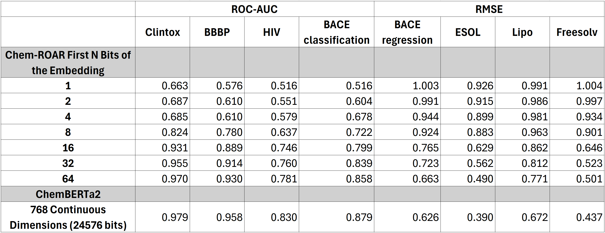
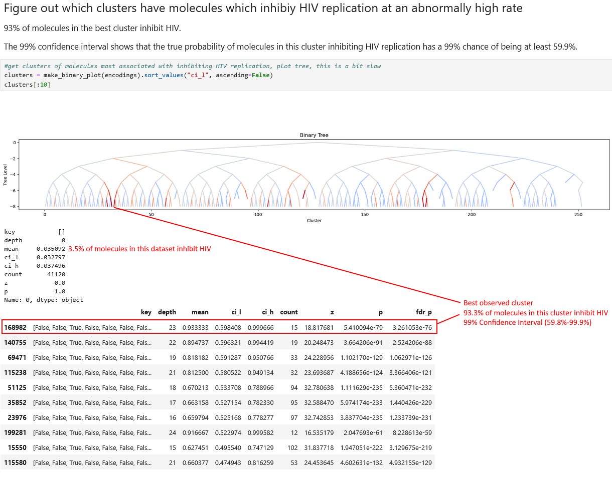
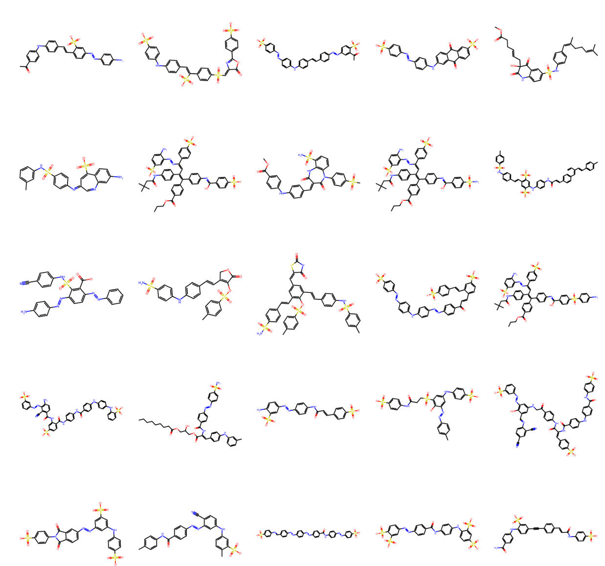

# ChemROAR
ChemROAR is a novel generative embedding architecture engineered for both clustering and synthesizing drug molecules. It organizes molecules into hierarchical clusters based on high-level similarities and then generates new candidate molecules by leveraging these groupings. This approach enables the design of molecules with targeted characteristics using minimal data and without additional model retraining.

At its core, ChemROAR is a transformer-based autoencoder that produces hierarchical binary embeddings, naturally segmenting data into discrete groups. It utilizes a Random Order AutoRegressive (ROAR) decoder to capture complex dependencies between SMILES sequences and various molecular properties.

ROAR models are designed to handle mixed-type data, seamlessly integrating SMILES sequences with tabular molecular properties during training. Each token is represented as a triplet comprising a Type, Position, and Value, which allows multiple data modalities to be incorporated into a single context without necessitating architectural changes or an overly large vocabulary. Random order modeling forces ChemROAR to learn to predict molecular properties from SMILES sequences and vice versa while retaining its generative strengths as an autoregressive model.

By combining an encoder that produces hierarchical, discrete embeddings with a random order decoder, ChemROAR effectively clusters molecules based on high-level similarities. Higher-level clusters capture broader, less specific traits and encompass more molecules, whereas lower-level clusters focus on detailed, specific properties with fewer members. Each cluster is discrete and therefore well defined, enabling the use of conventional statistical methods to quantify uncertainty and establish confidence intervals for the properties of each group. This framework allows for quantifiable statistical confidence about how likely it is that newly generated drug molecules will exhibit the desired properties.

ChemROAR is not a conventional molecular embedding model. Its focus is on representing as much information about each molecule in as few binary bits as possible. The more bits in the embedding the more possible hierarchical clusters and the fewer molecules in each cluster. We need statistical power to predict the properties of each cluster and we therefore we need model to partition molecules by key properties as early as possible in the tree. The performance-per-bit of the embeddings is therefore the most important criteria for this model. The table below shows the performance of an XGBoost model trained on MedROAR embeddings using the first 1 to 64 bits and compares this to the performance of an XGBoost model trained on a more conventional molecular embedding model like ChemBERTa2. We observe that ChemROAR is very effective at representing molecular information in a small number of bits. Using the first 64 bits of a MedROAR embedding achieves 92% of the performance of a ChemBERTa2 embedding with 0.26% of the information.




# Example: Clusters of Molecules Which Inhibit HIV Replication
### We observe clusters where >90% of molecules inhibit HIV compared to the baseline 3.5% seen in the dataset as a whole


# Examples of Molecules Generated by ChemROAR Using the Cluster Most Likely to Inhibit HIV Replication
### Obvious similarities can be seen between different molecules in this cluster


# Usage
See [the demo notebook](demo.ipynb) for an illustrated version
```
import pandas as pd
import torch
import ROAR
from utils import make_binary_plot

data = <load your data here>

smiles_strings = data[<get smiles strings>]
property = data[<get a known property>]

#load model from huggingface
device = torch.device("cuda" if torch.cuda.is_available() else "cpu")
model = ROAR.ChemROAR.from_pretrained("willbaskett/ChemROAR").to(device)

############
#EMBED DATA#
############
embeddings = model.embed(smiles_strings)

X = pd.DataFrame(embeddings).astype(bool)
y = property.copy()

encodings = X.copy()
encodings["label"] = y

#get clusters of molecules most associated with the property, sorted.
clusters = make_binary_plot(encodings).sort_values("ci_l", ascending=False)

#get the node associated with the best cluster, defined as a T/F traversal of the tree
target_node_vector = torch.tensor(clusters.iloc[0].key).float()

#############################
#GENERATE ~100 NEW MOLECULES#
#############################
possible_solutions = []
while len(possible_solutions) < 100:
    generated_molecules = model.generate_molecules(target_node_vector, batch_size=128, evaluate_after_n_tokens=128, temperature=1, topk=500, topp=0.95)
    possible_solutions += generated_molecules
    possible_solutions = list(set(possible_solutions))
    print(f"{len(possible_solutions)} total molecules found so far")

```
