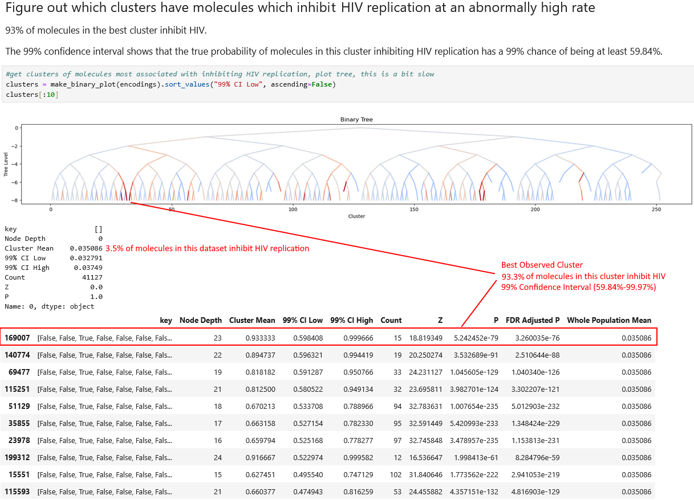

# ChemROAR
A novel generative embedding architecture for clustering and generating drug molecules. Finds heirarchical clusters of molecules with specific properties and then generates new molecules using those clusters. Allows for the generation of molecules arbitrary properties without additional model training.

ChemROAR is a transformer based autoencoder which generates a heirarchical binary embedding which naturally clusters data. It uses a Random Order AutoRegressive (ROAR) decoder to learn complex dependencies between SMILES sequences and molecular properties. 

ROAR models are capable of modeling mixed-type data, allowing seamless integration of SMILES sequences with tabular molecular properties during training. Each token input in a ROAR model consists of a Type, Position, Value triplit. This allows multiple data modalities to be included in the same context without any architectural considerations and without requiring an impractically large vocabulary. As autoregressive models, they also remain capable of generative modeling.

Combining an encoder which produces heirarchical discrete embeddings and a ROAR decoder forces the model to learn to hierarchically cluster molecules based on high-level similarities. Each cluster contains a finite number of samples. Higher-level, less specific clusters contain more samples. Lower-level, more specifc clusters contain fewer. Each cluster is well defined and contains a specific number of samples. This allows us to use conventional statistics to quantify uncertainty about the properties of each cluster and provide a confidence interval. This means that we can generate new drug molecules and have a well defined idea of how likely they are to do what we want.

# Example of Molecule Clustering: ChemROAR finds clusters of molecules which inhibit HIV replication

# Example of Molecule Generation: ChemROAR generates new molecules from this cluster

